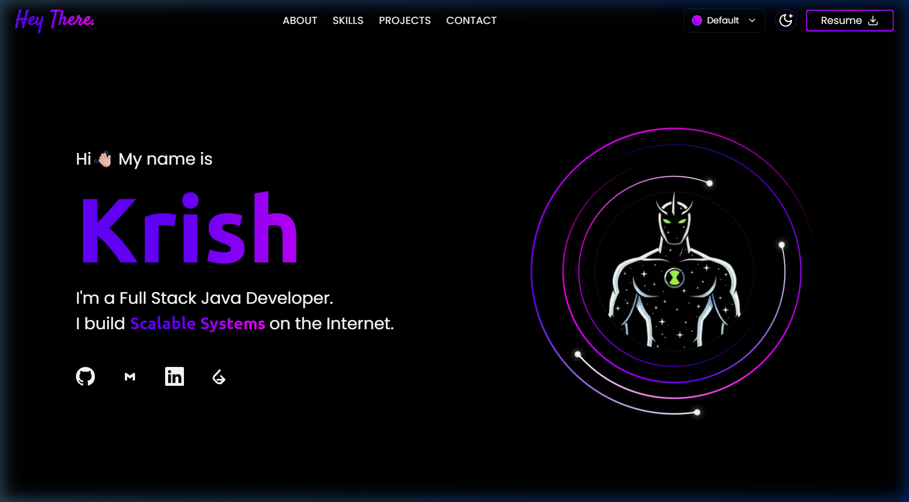
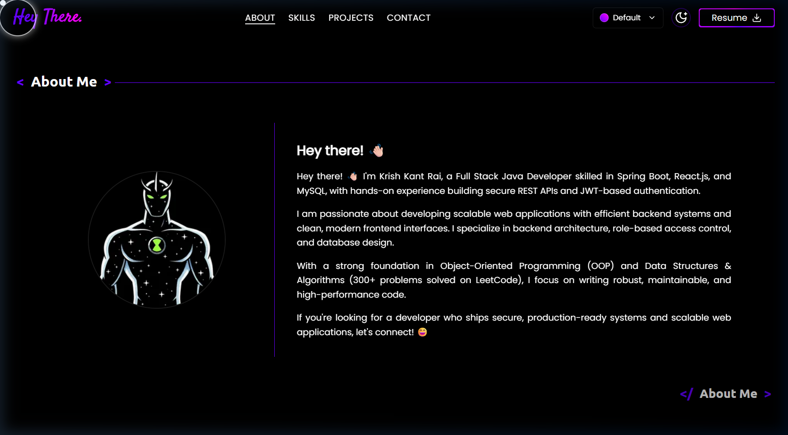
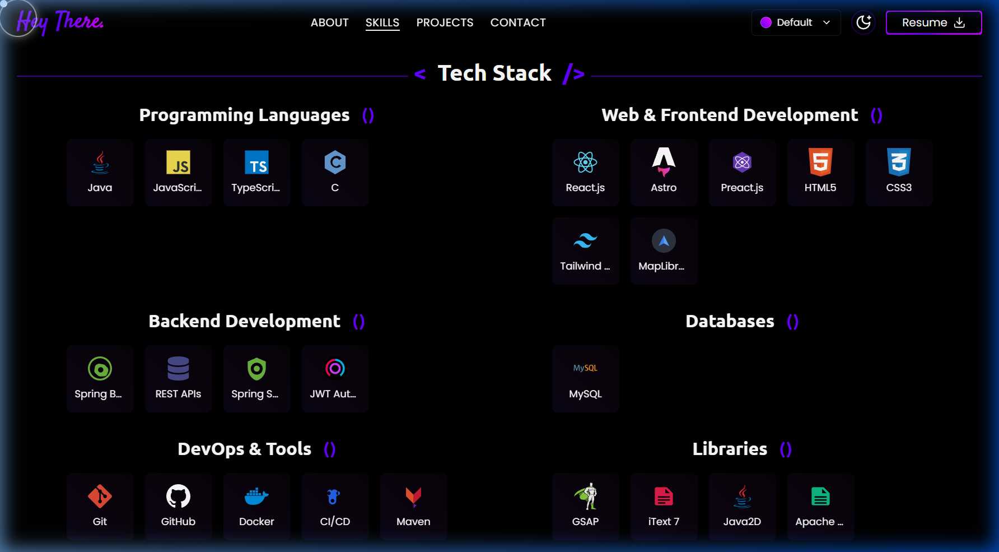

# Portfolio 💼✨

> **Build. Ship. Connect.**
> A modern, animated developer portfolio showcasing full-stack projects, skills, and experience.

**Live:** [krishkant.netlify.app](https://krishkant.netlify.app/) · **Author:** [Krish Kant Rai](https://linkedin.com/in/krish-kant-rai-3a8734338) · [GitHub](https://github.com/krishkantrai27)

---

## 📋 Table of Contents

1. [Overview](#-overview)
2. [Sections](#-sections)
3. [Features](#-features)
4. [Technology Stack](#️-technology-stack)
5. [Getting Started](#-getting-started)

---

## 🚀 Overview

This is my personal developer portfolio — built to present who I am, what I've built, and what I can do as a **Full Stack Java Developer**. It features a dynamic hero section, theme switching, an interactive skills grid, and a project showcase, all wrapped in a smooth, animated dark-mode-first UI.

---

## 📸 Sections

### 🏠 Hero

Landing section with animated intro, role tagline, orbiting avatar graphic, theme selector, and quick links to GitHub, Gmail, LinkedIn, and dev profiles.



---

### 👤 About Me

Personal introduction covering background, specialization (backend architecture, role-based access control, database design), and DSA proficiency (300+ problems on LeetCode).



---

### 🛠️ Skills / Tech Stack

Full technology breakdown organized into categories:

| Category | Technologies |
|:---|:---|
| **Programming Languages** | Java, JavaScript, TypeScript, C |
| **Web & Frontend** | React.js, Astro, Preact.js, HTML5, CSS3, Tailwind CSS, MapLibre GL |
| **Backend Development** | Spring Boot, REST APIs, Spring Security, JWT Authentication |
| **Databases** | MySQL |
| **DevOps & Tools** | Git, GitHub, Docker, CI/CD, Maven, Postman, Swagger, Vite |
| **Libraries** | GSAP, iText 7, Java2D, Apache Commons CSV |
| **Additional Skills** | OS, OOP, DSA |



---

### 💼 Projects

Showcase of real, production-oriented projects — including an ISP network site survey tool (floor canvas, RF heatmaps) and a full-stack crop/farm management system.

---

### 📬 Contact

Direct contact form for recruiters and collaborators to reach out.

---

## ✨ Features

- 🎨 Multiple color themes (Ocean and others) with light/dark mode toggle
- 📱 Fully responsive across mobile, tablet, and desktop
- ⚡ Smooth scroll-based animations (GSAP)
- 🧩 Modular, categorized skills grid
- 📄 One-click resume download
- 🔗 Social/profile quick-links (GitHub, LinkedIn, Gmail, dev platforms)

---

## 🛠️ Technology Stack

| Layer | Technology |
|:---|:---|
| **Frontend** | React.js / Astro, Tailwind CSS |
| **Animation** | GSAP |
| **Maps** | MapLibre GL |
| **Tooling** | Vite, ESLint |
| **Deployment** | Netlify |
| **Version Control** | Git, GitHub |

### Project Structure

```
portfolio/
├── public/
│   └── assets/          # Images, icons, resume PDF
└── src/
    ├── components/      # Hero, About, Skills, Projects, Contact, Navbar, Footer
    ├── data/             # Skills, projects, and links data
    ├── styles/           # Global and theme styles
    └── utils/            # Helpers
```

---

## 🏁 Getting Started

### Prerequisites

| Tool | Version |
|:---|:---|
| Node.js | 18+ |
| npm / yarn | Latest |

### Setup

```bash
git clone https://github.com/krishkantrai27/portfolio.git
cd portfolio
npm install
npm run dev
```

Open `http://localhost:5173` (or the port shown in terminal) to view it locally.

### Build for production

```bash
npm run build
```

---

## 📄 License

**Platform:** Portfolio — Personal Developer Website
**Author:** Krish Kant Rai
**LinkedIn:** [krish-kant-rai-3a8734338](https://linkedin.com/in/krish-kant-rai-3a8734338)
**GitHub:** [krishkantrai27](https://github.com/krishkantrai27)

---

*Made with 💻 and ☕ by Krish Kant Rai*
